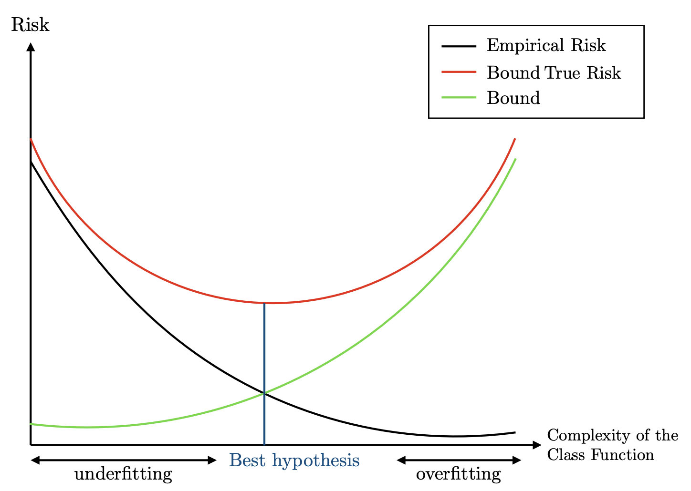

<!-- 
Title: "Apprentissage massif et données déséquilibrées - Entraînement et tuning" 
Author: rsquaredata
Last updated: 2025-12-03
-->

# Protocole d'entraînement & Optimisation des modèles

L'**entraînement et le tuning (réglage des hyperparamètres)** constituent la phase la plus critique et la plus élaborée 
de la **procédure d'apprentissage** en *Machine Learning*, particulièrement dans le contexte exigeant de la fouille de 
données massives. L'objectif est double : apprendre les paramètres du modèle tout en trouvant les meilleures valeurs 
pour les hyperparamètres afin d'assurer une performance optimale et généralisable.

## 1. Le protocole de séparation des données

Pour pouvoir évaluer la performance du modèle et tuner ses hyperparamètres sans biais, la phase d'entraînement 
nécessite une division stricte du jeu de données.

### 1.1 Train vs Test

1. **Ensemble d'entraînement (_Training Set_)** : Cet ensemble est utilisé pour apprendre les paramètres du modèle 
(par exemple, le paramètre $w$ d'un séparateur linéaire). L'algorithme a accès aux descripteurs ($x_i$) et aux 
étiquettes ($y_i$).

2. **Ensemble de test (_Test Set_)** : Cet ensemble est réservé pour **évaluer le modèle une fois qu'il a été appris**. 
L'étiquette n'est utilisée *a posteriori* que pour vérifier si la prédiction est correcte.

3. **Ratio de division** : Il est d'usage de conserver **environ 2/3 des exemples pour l'entraînement** et le reste 
(1/3) pour le test. Il faut suffisamment de données d'entraînement pour capturer toutes les spécificités de la 
distribution, mais aussi un ensemble de test assez grand pour que les résultats soient statistiquement significatifs.

4. **Contraintes temporelles** : Lorsque les données sont datées, la division doit être temporelle. Par exemple, pour 
un projet, les transactions du **2017-02-01 au 2017-08-31** sont l'ensemble d'apprentissage, et celles du 
**2017-09-01 au 2017-11-30** sont l'ensemble de test. Dans ce cas, il est crucial de *ne pas cross-valider* les modèles 
n'importe comment.

## 2. Le tuning des hyperparamètres par validation croisée

Le réglage des hyperparamètres ($\lambda$ ou $C$ pour les SVM, $\gamma$ pour le noyau gaussien, etc.) est crucial, car 
ils contrôlent la complexité du modèle et le compromis biais/variance.

  

### 2.1 La procédure de validation simple (Validation Set)

Une première méthode consiste à diviser l'ensemble d'entraînement en un ensemble d'apprentissage et un ensemble 
de **validation**. Le modèle est entraîné avec différentes valeurs de $\lambda_i$ sur l'ensemble d'apprentissage, et 
la performance $p_i$ est mesurée sur l'ensemble de validation. La valeur $\lambda_{i_{\max}} associée à la 
meilleure performance $p_{i_{\max}} est retenue.

### 2.2. La validation croisée ($k$-fold CV)

Cette méthode est préférable car elle résout le problème du sous-ensemble de validation potentiellement trop petit.

1. **Division** : L'ensemble d'entraînement est divisé en $k$ groupes ou plis (*folds*). On utilise généralement une 
**5-CV** dans les expérimentations SVM.

2. **Itérations** : Pour chaque valeur $\lambda_i$ à tester, l'algorithme apprend le modèle sur $k−1$ plis (ensemble 
d'apprentissage) et teste la performance sur le pli restant (ensemble de validation). Ce processus est répété $k$ fois.

3. **Sélection** : La performance finale $s_i$ pour ce $\lambda_i$ est la **moyenne des scores obtenus** sur les $k$ 
tours. On choisit la valeur $\lambda_{i_{\max}} qui a obtenu le score moyen le plus élevé.

4. **Entraînement final** : Le modèle final est appris sur tout l'ensemble d'entraînement en utilisant 
$\lambda_{i_{\max}}$.

La validation croisée permet de parcourir la totalité des données d'entraînement, accédant ainsi à une 
**plus grande partie de la distribution sous-jacente**, ce qui améliore les résultats pratiques.  
Cependant, elle nécessite d'apprendre $k$ modèles pour chaque valeur d'hyper-paramètre testée, ce qui peut être 
coûteux.

## 3. Application à des algorithmes spécifiques

Le tuning et l'entraînement varient selon le modèle :

- **SVM** : Il est nécessaire de tuner l'hyperparamètre $C$ pour les noyaux linéaires et $C$ **et** $\gamma$ pour les 
noyaux gaussiens (`rbf` sous Python) parmi des plages de valeurs prédéfinies (ex: $C \in {0.1,0.5,1,2,4} et 
 \gamma  in {0.01,0.1,1,10}$).

- **Deep Learning (Réseaux de neurones)** : L'entraînement est réalisé à l'aide de librairies comme **h2o** ou 
**Keras**. Le tuning des réseaux de neurones est complexe et implique de jouer sur de nombreux paramètres.

	- **Structure et régularisation** : Nombre de couches, nombre de neurones par couche (ex: trois couches de 40, 
20 puis 10 neurones), fonction d'activation (**"Tanh"**), et introduction de termes de régularisation $L_2$.

	- **Optimisation** : Nombre d'**epochs** (ex: 50 epochs), taille des *batches* (avec équilibrage des classes, 
taille minimale 50), utilisation du **"dropout"*, et réglage du **pas d'apprentissage** (ex: 0.01).

	- **Méthodologie** : Lors de la phase exploratoire, il est impératif de **ne changer les paramètres que un par un** 
pour observer l'effet de chaque modification sur le score.

## 4. Entraînement en contexte massif et optimisation

Dans le cadre des données massives, l'entraînement doit intégrer des considérations de rapidité.

- **Solveurs d'optimisation** : L'implémentation algorithmique requiert l'utilisation de solveurs. La fonction 
`optimize.fmin_l_bfgs_b` de la librairie `scipy` (méthode Quasi-Newton) est utilisée pour la résolution des 
problèmes d'optimisation.

- **Complexité et limites des Noyaux** : Il est démontré que l'entraînement des SVM avec noyaux est **très limité** 
lorsque le nombre de données est considérable, car il faut calculer $m^2$ similarités et potentiellement inverser une 
matrice $K \in \mathbb{R}^{m \times m}$.

- **Solutions d'approximation** : Pour rendre l'entraînement scalable, des méthodes d'approximation des noyaux sont 
utilisées, telles que les **Landmarks** (en sélectionnant un sous-ensemble $k \lt m$ de points pour l'apprentissage) 
ou les *Random Fourier Features (RFF)**, où l'on apprend un séparateur linéaire rapide sur des données projetées. Ces 
approximations doivent être évaluées en comparant les performances et le **temps d'apprentissage** avec le modèle 
initial.

## 5. Évaluation et mesures de performance

La fin de l'entraînement et du tuning conduit à l'évaluation finale.

- **Comparaison multicritères** : La procédure exige la comparaison des performances des différents algorithmes, en 
étudiant non seulement les performances (Précision, Rappel, F-mesure, AUC ROC), mais aussi le 
**temps d'apprentissage**.

- **Objectif de tuning** : Dans les problèmes déséquilibrés (comme la détection de fraude), on vise à maximiser des 
métriques spécifiques comme la **F-mesure**.

- **Techniques de pondération** : Lors de l'entraînement, l'utilisation du paramètre ***`class_weight` avec l'option 
"balanced"** permet de modifier le poids des classes pour traiter les déséquilibres, ce qui est une forme 
d'apprentissage sensible aux coûts (*Cost-Sensitive Learning*).

L'entraînement et le tuning représentent donc l'application d'un protocole expérimental rigoureux, nécessitant 
l'emploi de techniques de validation croisée avancées et une conscience aiguë des contraintes de scalabilité pour 
adapter les algorithmes de manière optimale aux données massives.
​	
 

